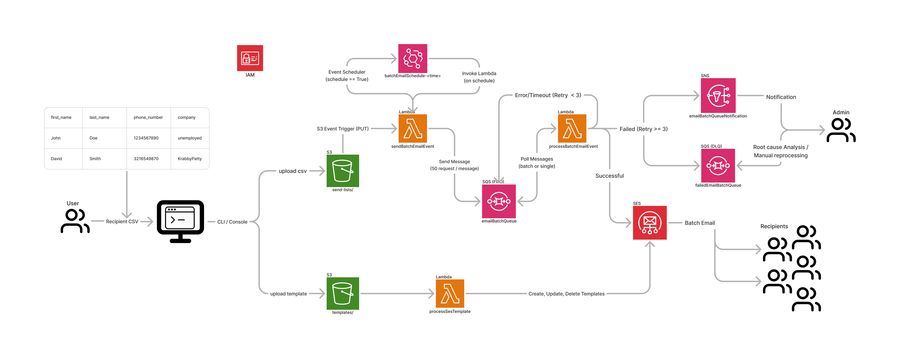

<a id="readme-top"></a>

[![Contributors][contributors-shield]][contributors-url]
[![Forks][forks-shield]][forks-url]
[![Stargazers][stars-shield]][stars-url]
[![Issues][issues-shield]][issues-url]
[![LinkedIn][linkedin-shield]][linkedin-url]

<!-- PROJECT LOGO -->
<br />
<div align="center">
  

  <div align="center">
    <h3>Batch Email Service (Work in Progress)</h3>
    <a href="https://github.com/john-jaihyek-choi/batch-email-service"><strong>Explore the docs »</strong></a>
    <br />
    <br />
    <!-- <a href="https://johnjhc.com" target="_blank">Live Demo</a>
    · -->
    <a href="https://github.com/john-jaihyek-choi/batch-email-service/issues/new?labels=bug&template=bug-report---.md">Report Bug</a>
    ·
    <a href="https://github.com/john-jaihyek-choi/batch-email-service/issues/new?labels=enhancement&template=feature-request---.md">Request Feature</a>
  </div>
</div>

<!-- UPDATE -->

<!-- ## Update

Body section for Update -->

<br />

<!-- TABLE OF CONTENTS -->
<details>
  <summary>Table of Contents</summary>
  <ol>
    <li>
      <a href="#preview">Preview</a>
    </li>
    <li>
      <a href="#about-the-project">About The Project</a>
    </li>
    <li>
      <a href="#features">Features</a>
    </li>
    <li>
      <a href="#architecture-diagram">Architecture Diagram</a>
    </li>
      <li><a href="#roadmap">Roadblocks and Roadmap</a></li>
    <li>
      <a href="#getting-started">Getting Started</a>
      <ul>
        <li><a href="#prerequisites">Prerequisites</a></li>
        <li><a href="#installation">Installation</a></li>
      </ul>
    </li>
    <!-- <li><a href="#usage">Usage</a></li> -->
    <li><a href="#contributing">Contributing</a></li>
    <li><a href="#contact">Contact</a></li>
    <!-- <li><a href="#acknowledgments">Acknowledgments</a></li> -->
  </ol>
</details>

<!-- PREVIEW -->

<!-- ## Preview

<p align="center">
  
</p>

<p align="right">(<a href="#readme-top">back to top</a>)</p> -->

<!-- ABOUT THE PROJECT -->

## About The Project

The Batch Email Service is a serverless application that utilizes AWS cloud services such as Lambda, SES, SQS, and DynamoDB where user can send out a batch, templated email, quickly and easily.

This application is being create for a marketing friend of mine who had recently been struggling sending out an his marketing email to a list of recipients. He was actively seeking a software that fufills his needs, but realized that the subcription cost for some of these 3rd party application were ridiculously expensive for such trivial functionality.

The main objective of this project is to create a service where a user can batch send emails cost effectively with less manual intervention. This service will primarily focus on functionality of batch sending email, managing email templates, manage recipients, and schedule send a batch of email.

Since the goal is to focus on the functionality, for MVP, the UI/UX will be handled via AWS console, and with CLI (cli training). Hopefully, the use of the service becomes useful to a point where I need to create a proper frontend component.

<p align="right">(<a href="#readme-top">back to top</a>)</p>

<!-- FEATURES -->

## Features

#### Send Email

- Admin can upload batch email recipients (via AWS console)
- Admin can upload batch email recipients on schedule (via AWS console)

#### Receive Email

- Admin receives email notification about SendBatchEmailEvent (SQS message queueing) operation failures
- Admin receives email notification about ProcessBatchEmailEvent (sending email out to recipients) operation failures
- Admin receives email notification about ProcessSESTemplate (email template upload) operation failures
- Recipient receives personalized email

#### Manage Template

- Admin can upload a new template
- Admin can update an existing template
- Admin can delete an existing template

<p align="right">(<a href="#readme-top">back to top</a>)</p>

<!-- ARCHITECTURE DIAGRAM -->

## Architecture Diagram

|              | Languages / Tools / Services                                                                                                                                                           |
| ------------ | -------------------------------------------------------------------------------------------------------------------------------------------------------------------------------------- |
| **Language** | [![Python][Python]][Python-url]                                                                                                                                                        |
| **Backend**  | [![Lambda][AWSLambda]][AWSLambda-url] [![AWSSES][AWSSES]][AWSSES-url] [![AWSSQS][AWSSQS]][AWSSQS-url] [![S3][S3]][S3-url] [![DynamoDB][DynamoDB]][DynamoDB-url] [![IAM][IAM]][IAM-url] |

<p align="center">
  
</p>

<p align="right">(<a href="#readme-top">back to top</a>)</p>

<!-- ROADMAP -->

## Roadblocks and Roadmap

#### Roadblocks

- [x] SES Sandbox -> Production
  - AWS account, by default, is enabled with SES sandbox mode which allows 200 emails per day limit. Admin must open a ticket with AWS to enable production, then to update qutoa limit for number of emails per day send limit.
- [x] [Email Deliverability Issue](#email-deliverability-issue)

#### Roadmap

##### MVP

- [x] Initial Setup
  - SES Setup
    - [x] verify SES email domain
    - [x] test email sending
      - [x] configure DKIM, DNS, and SPF properly to ensure the email hits recipient email's inbox (not spam)
    - [x] create sample email templates
- [x] S3 bucket resource provisioning
  - [x] jc-batch-email-services-bucket
    - [x] enable version controlling
    - [x] life-cycle policy (Optional)
    - [x] event trigger filter
      - [x] send-lists/ prefix
      - [x] templates/ prefix
    - [x] asset/ prefix
      - [x] storage for resources in assets/
    - [x] templates
      - [x] send batch email lambda templates for admin notification
      - [ ] process batch email lambda templates for recipient facing email
- [x] SQS resource provisioning
  - [x] failedEmailBatchQueue (DLQ)
    - [x] max retry configuration (maxReceiveCount)
  - [x] emailBatchQueue
    - [x] configure visibility timeout (default 30sec)
- [x] SQS producer lambda (SendBatchEmailEvent)
  - [x] Test cases
  - [x] Logic implementation
    - [x] N recipients / message (SQS message)
    - [x] SES for failure notification via email using html template (SES)
    - [x] Delete/retire fully failed batches in s3
    - [x] LRU caching for template-specific field DDB lookups
  - [x] CDK Resource provisioning
    - [x] Lambda execution role and policy settings
    - [x] Lambda function and configuration
- [ ] Template processor Lambda (ProcessSESTemplate)
  - [ ] Test cases
  - [x] Logic implementation
    - [x] s3 event for CREATE/PUT and DELETE
    - [x] scan template content and collect dynamic variables
    - [x] create/update/delete template metadata to ddb
  - [ ] CDK Resource provisioning
    - [ ] DDB table creation
    - [ ] Lambda execution role and policy setting
    - [ ] Lambda function and configuration
- [ ] SQS consumer lambda (processBatchEmailEvent)
  - [ ] Test cases
  - [ ] Logic implementation
    - [ ] send email via SES
      - [ ] handle single and multiple send_to list
      - [ ] implement lru caching for template s3 lookup to minimize api calls
    - [ ] SES for failure notification via email using html template (SES)
    - [ ] archive s3 object upon successful processing
  - [ ] CDK Resource provisioning
    - [ ] add event source as emailBatchQueue
    - [ ] reserved concurrency
- [ ] Schedule Email Batch Lambda (ScheduleBatchEmailEvent)
  - [ ] Test cases
  - [ ] Logic implementation
    - [ ] create event bridge schedule with sendBatchEmailEvent as a target
    - [ ] Event bridge InputTransformer to transform event payload for sendBatchEmailEvent
  - [ ] CDK Resource provisioning
- [ ] Recipient Management Template
  - [ ] create CSV template with necessary recipient fields
- [ ] End to end testing
  - [ ] send batch emails
  - [ ] upload/delete templates
- [ ] Monitoring
  - Create custom metrics for SES (Optional)
    - [ ] email delivery success rates
    - [ ] SES bounce/complaint rates
    - [ ] SQS message failures (via DLQ)
    - [ ] set up CloudWatch alarms
- [ ] Optimization and Scaling
  - [ ] tune SQS and Lambda batch size appropriately
  - [ ] SES production mode request and rate limit increase based on required loads per day
- [ ] CDK Infrastructure Finalization
  - [ ] Review the CDK stack and add all missing resources to manage via CDK deployment
- [ ] Documentation Update
  - [ ] setup
  - [ ] deployment
  - [ ] operation steps / instruction manual
    - [ ] CSV preparation
    - [ ] CLI/Console operation
      - [ ] send batch email
        - [ ] standard send
        - [ ] schedule send
      - [ ] template creation and management
        - [ ] create template
        - [ ] update template
        - [ ] delete template

##### Future Enhancement

- [ ] Error Handling
  - [ ] automate handling of failed messages in DLQ (preferably via Lambda)
- [ ] Frontend Update
  - [ ] frontend UI/UX via React
  - [ ] REST API for frontend client to upload S3 via API call
  - [ ] authenticated user login using Cognito

See the [open issues](https://github.com/john-jaihyek-choi/batch-email-service/issues) for a full list of proposed features (and known issues).

<p align="right">(<a href="#readme-top">back to top</a>)</p>

<!-- GETTING STARTED -->

<!-- ## Getting Started

This is an example of how you may give instructions on setting up your project locally.
To get a local copy up and running follow these simple example steps.

### Prerequisites

Please make sure that npm is installed in your machine.

```sh
npm install npm@latest -g
```

### Installation

1. Clone the repo
   ```sh
   git clone https://github.com/john-jaihyek-choi/batch-email-service.git
   ```
2. Navigate to the cloned directory

   ```shell
   cd <repo-name>/
   ```

3. Install all dependencies

   ```shell
   npm install
   ```

4. Start the project

   ```shell
   npm run dev
   ```

5. Open your default web browser and navigate to http://localhost:3000/ to see the result!

<p align="right">(<a href="#readme-top">back to top</a>)</p> -->

<!-- USAGE EXAMPLES -->

<!-- ## Usage

Use this space to show useful examples of how a project can be used. Additional screenshots, code examples and demos work well in this space. You may also link to more resources.

_For more examples, please refer to the [Documentation](https://example.com)_

<p align="right">(<a href="#readme-top">back to top</a>)</p> -->

<!-- CONTRIBUTING -->

## Contributing

If anyone would be interested in contributing to the development/enhancement of this application, please don't hesitate to do so, any help would be **greatly appreciated**

For any suggestion or enhancement requests, please fork the repo and create a pull request, or simply open an issue with the tag "enhancement".

1. Fork the Project
2. Create your Feature Branch (`git checkout -b feature/AmazingFeature`)
3. Commit your Changes (`git commit -m 'Add some AmazingFeature'`)
4. Push to the Branch (`git push origin feature/AmazingFeature`)
5. Open a Pull Request

### Contributors:

<a href="https://github.com/john-jaihyek-choi/batch-email-service/graphs/contributors">
  
</a>

<p align="right">(<a href="#readme-top">back to top</a>)</p>

<!-- CONTACT -->

## Contact

John Choi - [website](https://johnjhc.com) - choi.john.jh@gmail.com

Project Link: [https://github.com/john-jaihyek-choi/batch-email-service](https://github.com/john-jaihyek-choi/batch-email-service)

<p align="right">(<a href="#readme-top">back to top</a>)</p>

<!-- DEVELOPMENT NOTE -->

## Development Note

#### SES Templated Email Limitation:

- Issue:
  - My original plan for sending an email was using the templated email API to send dynamically fill in variables in the template.
    - However, this came with one main limitation - [inability to attach external files](https://docs.aws.amazon.com/ses/latest/dg/send-email-raw.html).
- Workaround:
  - Due to such limitation, the workaround was sending raw email rather than templated email.
    - General approach:
      - s3 to store email templates
      - get the template stored in s3 from consumer/producer lambda
      - substitute dynamic variables in the template with meaningful data
      - build MIME and attach the template along with any attachment files needed (ie csv file)

#### Cost Analysis:

- Main point of discussion:
  - 1 sqs message per recipient vs 1 sqs message per N recipient (Approach 1)
    - 1 message per recipient is the quickest and the most simple implementation, but will result in much more unique messages and unique lambda execution
      - Higher number of messages being enqued to SQS and higher number of unique lambda execution
    - 1 sqs message per N recipient is more implementation, but will result in less unique messages to queue and unique lambda executions (Approach 2)
      - Lower number of messages enqued to SQS and lower number of unique lambda execution
- Comparison:
  - AWS Pricing:
    - SQS pricing:
      - $0.40 per million message / $0.0000004 per message
    - Lambda pricing:
      - Request Charge:
        - $0.20 per million invocation / $0.0000002 per invocation
      - Compute Duration Charge:
        - $0.0000166667 for every GB-second (1000ms)
      - Ephemeral Storage Charge:
        - Free for 512GB
  - Assumptions:
    - 10,000,000 emails to recipients per month
    - No free tier discounts applied
    - Lambda consumes 1 batch at a time
    - Approach 1
      - Recipient per message = 1
      - Average lambda execution time = ~1s
      - Lambda Memory = 128MB
      - 10,000,000 unique requests
    - Approach 2
      - Recipients per message = 100
      - Average lambda execution time = ~95s (considering time saving on init time, etc)
      - Lambda Memory = 128MB
      - 100,000 unique requests
  - Estimation:
    - Approach 1:
      - Lambda Cost:
        - Compute Duration Charge:
          - 0.128GB (128MB) _ 1 (seconds) _ 10,000,000 (invocations) = 1,280,000 GB-second
          - 1,280,000 GB-s \* 0.0000166667 = ~$21.34/month
        - Request Charge:
          - 10,000,000 (invocations) \* $0.0000002 ($0.20/million) = ~$2/month
        - Ephemeral Storage Charge:
          - Free up to 512MB
        - Total Lambda Cost:
          - $21.34 (compute) + $2 (Request) + 0 (ephemeral) = ~$24.34/month
      - SQS Cost:
        - 10,000,000 messages \* $0.0000004
        - monthly cost estimate = $4/month
      - Total Monthly Cost:
        - $21.34 (Lambda) + $4 (SQS) = ~$25.34/month
    - Approach 2:
      - Lambda Cost:
        - Compute Duration Charge:
          - 0.128GB (128MB) _ 95 (seconds) _ 100,000 (invocations) = 1,216,000 GB-second
          - 1,216,000 GB-s \* 0.0000166667 = ~$20.27/month
        - Request Charge:
          - 100,000 (invocations) \* $0.0000002 ($0.20/million) = $0.02/month
        - Ephemeral Storage Charge:
          - Free up to 512MB
        - Total Lambda Cost:
          - $20.27 (compute) + $0.02 (Request) + 0 (ephemeral) = $20.29
      - SQS Cost:
        - 100,000 messages \* $0.0000004
        - monthly cost estimate = $0.04/month
      - Total Monthly Cost:
        - $20.29 (Lambda) + $0.04 (SQS) = ~$20.34/month
  - Conclusion:
    - Based on the estimation, there's about 20% potential saving with Approach 2
    - Design Path:
      - sendBatchEmailEvent processes R number of recipients (ie 100) per message and sends M number of messages (max = 10) in batch
        - Allow M and R to be adjustable via environment variable
      - processBatchEmailEvent (with batch_size = 1) processes each message (containing R recipients) and makes total of R many SendTemplatedEmail API call in a single invocation
        - Fix batch_size to 1 for less complexity and to prevent longer lambda execution
        - Lambda, by default, has 1000 concurrency which should be sufficient for the use of this application

#### Email Deliverability Issue:

- Issue:
  - Emails sent via Amazon SES were landing in the spam (junk) folder of recipients instead of their inbox.
- Root cause:
  - The domain was missing proper email authentication records (SPF, DKIM, and DMARC).
  - Without these records, recipient mail servers flagged the emails as unauthenticated or suspicious, reducing deliverability.
- Resolution:
  - SPF Configuration:
    - Added a TXT record to the domain’s DNS settings
      ```sh
      v=spf1 include:amazonses.com ~all
      ```
      This allows Amazon SES to send authenticated emails on behalf of the domain.
  - DKIM Configuration:
    - Enabled DKIM in Amazon SES properly.
  - Testing:
    - Verified the SPF and DKIM records using [MXToolbox](https://mxtoolbox.com/dmarc.aspx).
    - Sent test emails to confirm inbox placement.
- References:
  - [Amazon SES – Authenticating Your Emails with SPF and DKIM](https://docs.aws.amazon.com/ses/latest/dg/send-email-authentication-spf.html)
  - [Amazon SES – Troubleshooting Email Deliverability](https://docs.aws.amazon.com/ses/latest/dg/Welcome.html)

<p align="right">(<a href="#readme-top">back to top</a>)</p>

<!-- ACKNOWLEDGMENTS -->

## Acknowledgments

List of resources found valuable for development

- [Best practices for sending email using Amazon SES](https://docs.aws.amazon.com/ses/latest/dg/best-practices.html)
- [Sending test emails in Amazon SES with the simulator](https://docs.aws.amazon.com/ses/latest/dg/send-an-email-from-console.html#send-test-email)
- [DMARC Check Tool](https://mxtoolbox.com/dmarc.aspx)
- [Mocking AWS for testing](https://docs.getmoto.org/en/latest/docs/getting_started.html)
- [AWS CDK API Documentation](https://docs.aws.amazon.com/cdk/api/v2/docs/aws-construct-library.html)
- [Mail Tester App](https://www.mail-tester.com/)
- [SES Pitfalls](https://dev.to/slsbytheodo/from-zero-to-hero-send-aws-ses-emails-like-a-pro-4nei)
- [Free Email HTML Templates](https://designmodo.com/email-templates/)
- [HTML real-time editor](https://htmledit.squarefree.com/)

<p align="right">(<a href="#readme-top">back to top</a>)</p>

<!-- BADGES -->

<!-- Badges available - https://shields.io/badges -->

[contributors-shield]: https://img.shields.io/github/contributors/john-jaihyek-choi/batch-email-service?style=for-the-badge
[contributors-url]: https://github.com/john-jaihyek-choi/batch-email-service/graphs/contributors
[forks-shield]: https://img.shields.io/github/forks/john-jaihyek-choi/batch-email-service?style=for-the-badge
[forks-url]: https://github.com/john-jaihyek-choi/batch-email-service/network/members
[stars-shield]: https://img.shields.io/github/stars/john-jaihyek-choi/batch-email-service?style=for-the-badge
[stars-url]: https://github.com/john-jaihyek-choi/batch-email-service/stargazers
[issues-shield]: https://img.shields.io/github/issues/john-jaihyek-choi/batch-email-service?style=for-the-badge
[issues-url]: https://github.com/john-jaihyek-choi/batch-email-serviceues
[license-shield]: https://img.shields.io/github/license/john-jaihyek-choi/batch-email-service?style=for-the-badge
[license-url]: https://github.com/john-jaihyek-choi/batch-email-service/blob/main/LICENSE.txt
[linkedin-shield]: https://img.shields.io/badge/-LinkedIn-black.svg?style=for-the-badge&logo=linkedin&colorB=555
[linkedin-url]: https://linkedin.com/in/johnjaihyekchoi
[React.js]: https://img.shields.io/badge/React-20232A?style=for-the-badge&logo=react&logoColor=61DAFB
[React-url]: https://reactjs.org/
[Next.js]: https://img.shields.io/badge/next.js-000000?style=for-the-badge&logo=nextdotjs&logoColor=white
[Next.js-url]: https://nextjs.org/
[Bootstrap.com]: https://img.shields.io/badge/Bootstrap-563D7C?style=for-the-badge&logo=bootstrap&logoColor=white
[Bootstrap-url]: https://getbootstrap.com
[HTML5]: https://img.shields.io/badge/HTML5-red?style=for-the-badge&logo=html5&labelColor=%E34F26&logoColor=white
[HTML5-url]: https://html.com/html5/
[CSS3]: https://img.shields.io/badge/CSS3-white?style=for-the-badge&logo=css3&logoColor=white&labelColor=%231572B6&color=%231572B6
[CSS3-url]: https://css3.com
[Express.js]: https://img.shields.io/badge/Express.JS-white?style=for-the-badge&logo=express&logoColor=white&labelColor=%23000000&color=%23000000
[Express.js-url]: https://express.com
[Python]: https://img.shields.io/badge/Python-white?style=for-the-badge&logo=python&logoColor=white&labelColor=%233776AB&color=%233776AB
[Python-url]: https://python.org
[JavaScript]: https://img.shields.io/badge/JavaScript-white?style=for-the-badge&logo=javascript&logoColor=%23F7DF1E&labelColor=black&color=black
[JavaScript-url]: https://javascript.com
[TypeScript]: https://img.shields.io/badge/TypeScript-white?style=for-the-badge&logo=typescript&logoColor=white&labelColor=balck&color=%233178C6
[TypeScript-url]: https://www.typescriptlang.org/
[Node.js]: https://img.shields.io/badge/Node.JS-white?style=for-the-badge&logo=nodedotjs&logoColor=%235FA04E&labelColor=black&color=black
[Node.js-url]: https://nodejs.org/en
[PostgreSQL]: https://img.shields.io/badge/PostgreSQL-white?style=for-the-badge&logo=postgresql&logoColor=white&labelColor=%234169E1&color=%234169E1
[PostgreSQL-url]: https://www.postgresql.org/
[AWSEC2]: https://img.shields.io/badge/AWS%20EC2-orange?style=for-the-badge&logo=amazonec2&labelColor=%FF9900&logoColor=white
[AWSEC2-url]: https://aws.amazon.com/pm/ec2/
[AWSLambda]: https://img.shields.io/badge/AWS%20Lambda-gray?style=for-the-badge&logo=awslambda&labelColor=%23FF9900&logoColor=white
[AWSLambda-url]: https://aws.amazon.com/pm/lambda/
[S3]: https://img.shields.io/badge/AWS%20S3-gray?style=for-the-badge&logo=amazons3&labelColor=%569A31&logoColor=%569A31
[S3-url]: https://aws.amazon.com/s3/
[APIGateway]: https://img.shields.io/badge/AWS%20API%20Gateway-gray?style=for-the-badge&logo=amazonapigateway&labelColor=%FF4F8B&logoColor=%FF4F8B
[APIGateway-url]: https://aws.amazon.com/api-gateway/
[DynamoDB]: https://img.shields.io/badge/DynamoDB-gray?style=for-the-badge&logo=amazondynamodb&logoColor=%4053D6
[DynamoDB-url]: https://aws.amazon.com/pm/dynamodb/
[AmazonCognito]: https://img.shields.io/badge/Amazon%20Cognito-gray?style=for-the-badge&logo=amazoncognito&logoColor=%DD344C
[AmazonCognito-url]: https://aws.amazon.com/pm/cognito/
[AWSSQS]: https://img.shields.io/badge/AWS%20SQS-white?style=for-the-badge&logo=amazonsqs&logoColor=white&color=%23FF4F8B
[AWSSQS-url]: https://aws.amazon.com/pm/sqs/
[AWSSES]: https://img.shields.io/badge/AWS%20SES-white?style=for-the-badge&logo=amazonsimpleemailservice&logoColor=white&color=%23DD344C
[AWSSES-url]: https://aws.amazon.com/ses/
[AWSSNS]: https://img.shields.io/badge/AWS%20SNS-white?style=for-the-badge&color=%23DD344C
[AWSSNS-url]: https://aws.amazon.com/sns/
[AWSEventBridge]: https://img.shields.io/badge/AWS%20Event%20Bridge-white?style=for-the-badge&logoColor=white&color=%23FF4F8B
[AWSEventBridge-url]: https://aws.amazon.com/eventbridge/
[IAM]: https://img.shields.io/badge/IAM-white?style=for-the-badge&logo=amazoniam&logoColor=white&color=%23DD344C
[IAM-url]: https://aws.amazon.com/iam/
[Vue.js]: https://img.shields.io/badge/Vue.js-35495E?style=for-the-badge&logo=vuedotjs&logoColor=4FC08D
[Vue-url]: https://vuejs.org/
[Angular.io]: https://img.shields.io/badge/Angular-DD0031?style=for-the-badge&logo=angular&logoColor=white
[Angular-url]: https://angular.io/
[Svelte.dev]: https://img.shields.io/badge/Svelte-4A4A55?style=for-the-badge&logo=svelte&logoColor=FF3E00
[Svelte-url]: https://svelte.dev/
[Laravel]: https://img.shields.io/badge/Laravel-FF2D20?style=for-the-badge&logo=laravel&logoColor=white
[Laravel-url]: https://laravel.com
[JQuery]: https://img.shields.io/badge/jQuery-0769AD?style=for-the-badge&logo=jquery&logoColor=white
[JQuery-url]: https://jquery.com
