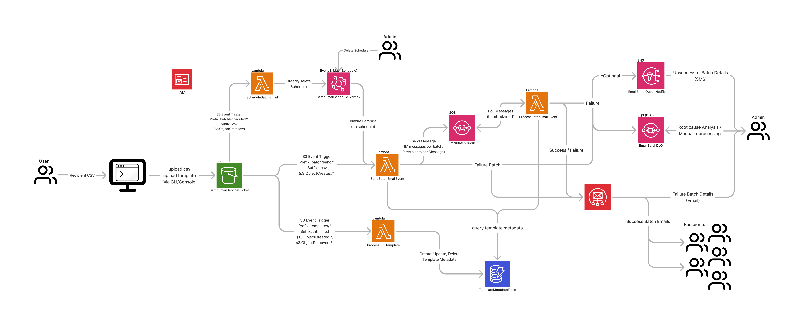

<a id="readme-top"></a>

[![Contributors][contributors-shield]][contributors-url]
[![Forks][forks-shield]][forks-url]
[![Stargazers][stars-shield]][stars-url]
[![Issues][issues-shield]][issues-url]
[![MIT License][license-shield]][license-url]
[![LinkedIn][linkedin-shield]][linkedin-url]

<!-- PROJECT LOGO -->
<br />
<div align="center">
  

  <div align="center">
    <h3>Batch Email Service</h3>
    <a href="https://github.com/john-jaihyek-choi/batch-email-service"><strong>Explore the docs »</strong></a>
    <br />
    <br />
    <!-- <a href="https://johnjhc.com" target="_blank">Live Demo</a>
    · -->
    <a href="https://github.com/john-jaihyek-choi/batch-email-service/issues/new?labels=bug&template=bug-report---.md">Report Bug</a>
    ·
    <a href="https://github.com/john-jaihyek-choi/batch-email-service/issues/new?labels=enhancement&template=feature-request---.md">Request Feature</a>
  </div>
</div>

<!-- UPDATE -->

<!-- ## Update

Body section for Update -->

<br />

<!-- TABLE OF CONTENTS -->
<details>
  <summary>Table of Contents</summary>
  <ol>
    <li>
      <a href="#preview">Preview</a>
    </li>
    <li>
      <a href="#about-the-project">About The Project</a>
    </li>
    <li>
      <a href="#features">Features</a>
    </li>
    <li>
      <a href="#architecture-diagram">Architecture Diagram</a>
    </li>
    <li>
      <a href="#getting-started">Getting Started</a>
      <ul>
        <li><a href="#prerequisites">Prerequisites</a></li>
        <li><a href="#installation">Installation</a></li>
      </ul>
    </li>
    <!-- <li><a href="#usage">Usage</a></li> -->
    <li><a href="#roadmap">Roadmap</a></li>
    <li><a href="#contributing">Contributing</a></li>
    <li><a href="#license">License</a></li>
    <li><a href="#contact">Contact</a></li>
    <!-- <li><a href="#acknowledgments">Acknowledgments</a></li> -->
  </ol>
</details>

<!-- PREVIEW -->

<!-- ## Preview

<p align="center">
  
</p>

<p align="right">(<a href="#readme-top">back to top</a>)</p> -->

<!-- ABOUT THE PROJECT -->

## About The Project

The Batch Email Service is a serverless functionality that utilizes AWS cloud services such as Lambda, SES, SQS, and CloudWatch where user can send out a batch, templated email, quickly and easily.

This application is created for a marketing friend of mine who had always been struggling sending out an his personal marketing email to a list of recipients. He was actively seeking a software that fufills his needs, but realized that the subcription cost for some of these 3rd party application were ridiculously expensive for such trivial functionality.

The main objective of this project is to create a service where my marketing friend can batch send emails cost effectively with less manual intervention. This service will primarily focus on functionality of batch sending email, managing email templates, manage recipients, and schedule send a batch email.

Since the goal is to focus on the functionality, for MVP, the UI/UX will be handled via AWS console, and with CLI (cli training). Hopefully, the use of the service becomes useful to a point where I need to create a proper frontend component.

<p align="right">(<a href="#readme-top">back to top</a>)</p>

<!-- FEATURES -->

## Features

#### Send Email

- User can send batch email
- User can schedule a batch email

#### Manage Template

- User can create (upload) a template
- User can update a template
- User can delete a template

<p align="right">(<a href="#readme-top">back to top</a>)</p>

<!-- ARCHITECTURE DIAGRAM -->

## Architecture Diagram

|              | Languages / Tools / Services                                                                                              |
| ------------ | ------------------------------------------------------------------------------------------------------------------------- |
| **Language** | [![Python][Python]][Python-url]                                                                                           |
| **Backend**  | [![Lambda][AWSLambda]][AWSLambda-url] [![AWSSES][AWSSES]][AWSSES-url] [![AWSSQS][AWSSQS]][AWSSQS-url] [![S3][S3]][S3-url] |

<p align="center">
  
</p>

<p align="right">(<a href="#readme-top">back to top</a>)</p>

<!-- ROADMAP -->

## Roadblocks and Roadmap

#### Roadblocks

- AWS account, by default, is enabled with SES sandbox mode which allows 200 emails per day limit. Admin must open a ticket with AWS to enable production, then to update qutoa limit for number of emails per day send limit.

#### Roadmap

- [x] Add Changelog
- [x] Add back to top links
- [ ] Add Additional Templates w/ Examples
- [ ] Add "components" document to easily copy & paste sections of the readme
- [ ] Multi-language Support
  - [ ] Chinese
  - [ ] Spanish

See the [open issues](https://github.com/othneildrew/Best-README-Template/issues) for a full list of proposed features (and known issues).

<p align="right">(<a href="#readme-top">back to top</a>)</p>

<!-- GETTING STARTED -->

## Getting Started

This is an example of how you may give instructions on setting up your project locally.
To get a local copy up and running follow these simple example steps.

### Prerequisites

Please make sure that npm is installed in your machine.

```sh
npm install npm@latest -g
```

### Installation

1. Clone the repo
   ```sh
   git clone https://github.com/john-jaihyek-choi/batch-email-service.git
   ```
2. Navigate to the cloned directory

   ```shell
   cd <repo-name>/
   ```

3. Install all dependencies

   ```shell
   npm install
   ```

4. Start the project

   ```shell
   npm run dev
   ```

5. Open your default web browser and navigate to http://localhost:3000/ to see the result!

<p align="right">(<a href="#readme-top">back to top</a>)</p>

<!-- USAGE EXAMPLES -->

## Usage

Use this space to show useful examples of how a project can be used. Additional screenshots, code examples and demos work well in this space. You may also link to more resources.

_For more examples, please refer to the [Documentation](https://example.com)_

<p align="right">(<a href="#readme-top">back to top</a>)</p>

<!-- CONTRIBUTING -->

## Contributing

If anyone would be interested in contributing to the development/enhancement of this application, please don't hesitate to do so, any help would be **greatly appreciated**

For any suggestion or enhancement requests, please fork the repo and create a pull request, or simply open an issue with the tag "enhancement".

1. Fork the Project
2. Create your Feature Branch (`git checkout -b feature/AmazingFeature`)
3. Commit your Changes (`git commit -m 'Add some AmazingFeature'`)
4. Push to the Branch (`git push origin feature/AmazingFeature`)
5. Open a Pull Request

### Contributors:

<a href="https://github.com/john-jaihyek-choi/batch-email-service/graphs/contributors">
  
</a>

<p align="right">(<a href="#readme-top">back to top</a>)</p>

<!-- LICENSE -->

## License

Distributed under the MIT License. See `LICENSE.txt` for more information.

<p align="right">(<a href="#readme-top">back to top</a>)</p>

<!-- CONTACT -->

## Contact

John Choi - [website](https://johnjhc.com) - choi.john.jh@gmail.com

Project Link: [https://github.com/john-jaihyek-choi/batch-email-service](https://github.com/john-jaihyek-choi/batch-email-service)

<p align="right">(<a href="#readme-top">back to top</a>)</p>

<!-- ACKNOWLEDGMENTS -->

## Acknowledgments

List of resources found helpful during development

- [Best practices for sending email using Amazon SES](https://docs.aws.amazon.com/ses/latest/dg/best-practices.html)

<!-- <p align="right">(<a href="#readme-top">back to top</a>)</p>

<!-- BADGES -->

<!-- Badges available - https://shields.io/badges -->

[contributors-shield]: https://img.shields.io/github/contributors/john-jaihyek-choi/batch-email-service?style=for-the-badge
[contributors-url]: https://github.com/john-jaihyek-choi/batch-email-service/graphs/contributors
[forks-shield]: https://img.shields.io/github/forks/john-jaihyek-choi/batch-email-service?style=for-the-badge
[forks-url]: https://github.com/john-jaihyek-choi/batch-email-service/network/members
[stars-shield]: https://img.shields.io/github/stars/john-jaihyek-choi/batch-email-service?style=for-the-badge
[stars-url]: https://github.com/john-jaihyek-choi/batch-email-service/stargazers
[issues-shield]: https://img.shields.io/github/issues/john-jaihyek-choi/batch-email-service?style=for-the-badge
[issues-url]: https://github.com/john-jaihyek-choi/batch-email-serviceues
[license-shield]: https://img.shields.io/github/license/john-jaihyek-choi/batch-email-service?style=for-the-badge
[license-url]: https://github.com/john-jaihyek-choi/batch-email-service/master/LICENSE.txt
[linkedin-shield]: https://img.shields.io/badge/-LinkedIn-black.svg?style=for-the-badge&logo=linkedin&colorB=555
[linkedin-url]: https://linkedin.com/in/johnjaihyekchoi
[React.js]: https://img.shields.io/badge/React-20232A?style=for-the-badge&logo=react&logoColor=61DAFB
[React-url]: https://reactjs.org/
[Next.js]: https://img.shields.io/badge/next.js-000000?style=for-the-badge&logo=nextdotjs&logoColor=white
[Next.js-url]: https://nextjs.org/
[Bootstrap.com]: https://img.shields.io/badge/Bootstrap-563D7C?style=for-the-badge&logo=bootstrap&logoColor=white
[Bootstrap-url]: https://getbootstrap.com
[HTML5]: https://img.shields.io/badge/HTML5-red?style=for-the-badge&logo=html5&labelColor=%E34F26&logoColor=white
[HTML5-url]: https://html.com/html5/
[CSS3]: https://img.shields.io/badge/CSS3-white?style=for-the-badge&logo=css3&logoColor=white&labelColor=%231572B6&color=%231572B6
[CSS3-url]: https://css3.com
[Express.js]: https://img.shields.io/badge/Express.JS-white?style=for-the-badge&logo=express&logoColor=white&labelColor=%23000000&color=%23000000
[Express.js-url]: https://express.com
[Python]: https://img.shields.io/badge/Python-white?style=for-the-badge&logo=python&logoColor=white&labelColor=%233776AB&color=%233776AB
[Python-url]: https://python.org
[JavaScript]: https://img.shields.io/badge/JavaScript-white?style=for-the-badge&logo=javascript&logoColor=%23F7DF1E&labelColor=black&color=black
[JavaScript-url]: https://javascript.com
[TypeScript]: https://img.shields.io/badge/TypeScript-white?style=for-the-badge&logo=typescript&logoColor=white&labelColor=balck&color=%233178C6
[TypeScript-url]: https://www.typescriptlang.org/
[Node.js]: https://img.shields.io/badge/Node.JS-white?style=for-the-badge&logo=nodedotjs&logoColor=%235FA04E&labelColor=black&color=black
[Node.js-url]: https://nodejs.org/en
[PostgreSQL]: https://img.shields.io/badge/PostgreSQL-white?style=for-the-badge&logo=postgresql&logoColor=white&labelColor=%234169E1&color=%234169E1
[PostgreSQL-url]: https://www.postgresql.org/
[AWSEC2]: https://img.shields.io/badge/AWS%20EC2-orange?style=for-the-badge&logo=amazonec2&labelColor=%FF9900&logoColor=white
[AWSEC2-url]: https://aws.amazon.com/pm/ec2/
[AWSLambda]: https://img.shields.io/badge/AWS%20Lambda-gray?style=for-the-badge&logo=awslambda&labelColor=%23FF9900&logoColor=white
[AWSLambda-url]: https://aws.amazon.com/pm/lambda/
[S3]: https://img.shields.io/badge/AWS%20S3-gray?style=for-the-badge&logo=amazons3&labelColor=%569A31&logoColor=%569A31
[S3-url]: https://aws.amazon.com/s3/
[APIGateway]: https://img.shields.io/badge/AWS%20API%20Gateway-gray?style=for-the-badge&logo=amazonapigateway&labelColor=%FF4F8B&logoColor=%FF4F8B
[APIGateway-url]: https://aws.amazon.com/api-gateway/
[DynamoDB]: https://img.shields.io/badge/DynamoDB-gray?style=for-the-badge&logo=amazondynamodb&logoColor=%4053D6
[DynamoDB-url]: https://aws.amazon.com/pm/dynamodb/
[AmazonCognito]: https://img.shields.io/badge/Amazon%20Cognito-gray?style=for-the-badge&logo=amazoncognito&logoColor=%DD344C
[AmazonCognito-url]: https://aws.amazon.com/pm/cognito/
[AWSSQS]: https://img.shields.io/badge/AWS%20SQS-white?style=for-the-badge&logo=amazonsqs&logoColor=white&color=%23FF4F8B
[AWSSQS-url]: https://aws.amazon.com/pm/sqs/
[AWSSES]: https://img.shields.io/badge/AWS%20SES-white?style=for-the-badge&logo=amazonsimpleemailservice&logoColor=white&color=%23DD344C
[AWSSES-url]: https://aws.amazon.com/ses/
[Vue.js]: https://img.shields.io/badge/Vue.js-35495E?style=for-the-badge&logo=vuedotjs&logoColor=4FC08D
[Vue-url]: https://vuejs.org/
[Angular.io]: https://img.shields.io/badge/Angular-DD0031?style=for-the-badge&logo=angular&logoColor=white
[Angular-url]: https://angular.io/
[Svelte.dev]: https://img.shields.io/badge/Svelte-4A4A55?style=for-the-badge&logo=svelte&logoColor=FF3E00
[Svelte-url]: https://svelte.dev/
[Laravel]: https://img.shields.io/badge/Laravel-FF2D20?style=for-the-badge&logo=laravel&logoColor=white
[Laravel-url]: https://laravel.com
[JQuery]: https://img.shields.io/badge/jQuery-0769AD?style=for-the-badge&logo=jquery&logoColor=white
[JQuery-url]: https://jquery.com
